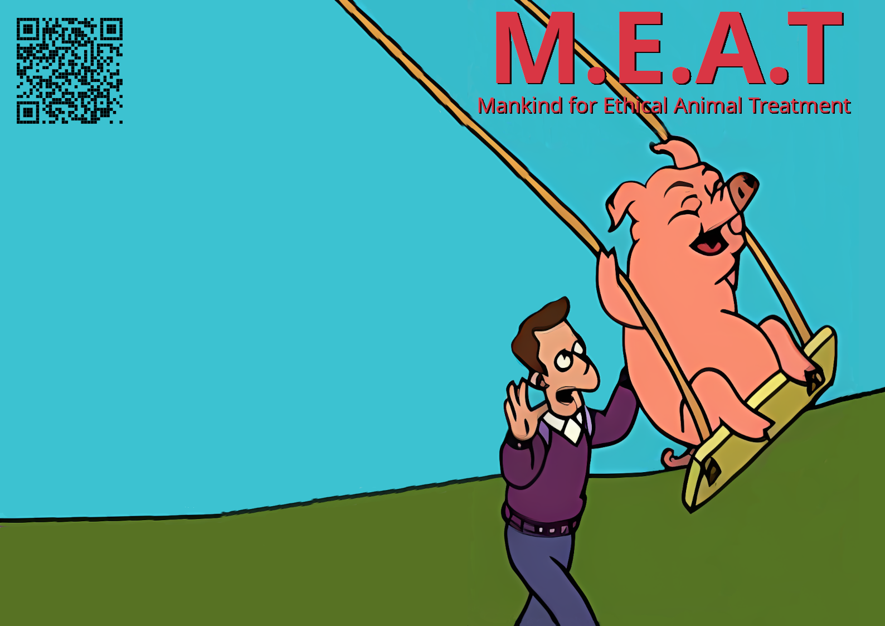

# MEAT (Mankind for Ethical Animal Treatment)

Based on a magazine shown in from [Futurama season 2 episode 18 "The Problem With Popplers"](https://en.wikipedia.org/wiki/The_Problem_with_Popplers).

This design is intended to be printed on A3 paper and used as a cover for a fake magazine by stapling it to a bunch of other A3 pages and folding them in half.

## Design method

* `1-Capture.png` was captured from the video
* `1-Capture.png` was then cropped to create `2-Cropped.png`
* `2-Cropped.png` was then opened in [Gimp](https://www.gimp.org/) and the perspective was fixed to create `3-PerspectiveFixed.png`
* `3-PerspectiveFixed.png` was then opened in [Upscayl](https://www.upscayl.org/) and upscaled 4x using the "Digital Art" model to create `4-PerspectiveFixed_upscayl_4x_realesrgan-x4plus-anime.png`
* `4-PerspectiveFixed_upscayl_4x_realesrgan-x4plus-anime.png` was opened in [Gimp](https://www.gimp.org/) and:
    * The clone and brush tools were used to remove the hand from the lower right and clean up a few other areas (especially the edges of the picture)
    * The clone tool was used to remove the "M.E.A.T." text from the top; this also meant removing the right rope of the swing but that was fixed by cloning the left rope
    * Resize to landscape A3 and fill in blanks with clone and spill pain tools
    * Add the "M.E.A.T." text
    * Add the "Mankind for Ethical Animal Treatment" text (not in the original, but I think we need to add it because people won't know what "M.E.A.T." means without the show to tell them)
    * Saved as `MEAT.xcf`
    * Exported to `MEAT.png`
